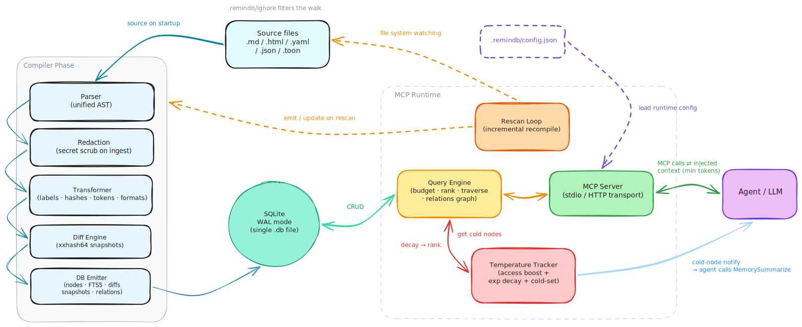
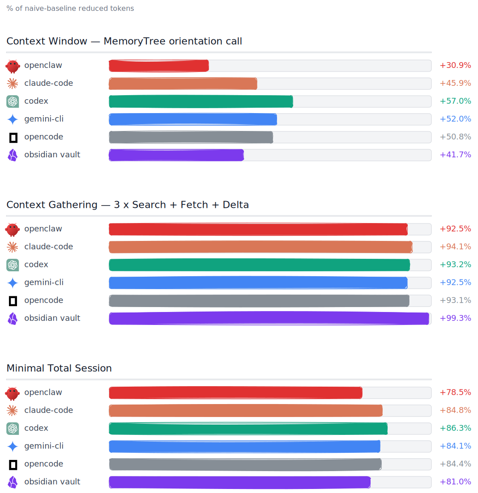

<p align="center">
  
</p>

<h1 align="center">remindb</h1>

<p align="center">
  Agentic memory in a single SQLite file.
  <br />
  Stop letting your agent re-read the same notes every session.
</p>

<p align="center">
  <a href="https://github.com/radimsem/remindb/actions/workflows/ci.yml"></a>
  <a href="https://github.com/radimsem/remindb/releases/latest"></a>
  <a href="LICENSE"></a>
  
</p>

---

<p align="center">
  
</p>

## Why I built this

Coding agents already have memory. `CLAUDE.md`, `AGENTS.md`, your notes folder, that growing pile of project READMEs. Stuff persists just fine.

The problem is *how* the agent consumes it. Every session starts by re-reading the whole pile from scratch — every `Read`, every `Grep`, scanning raw prose the agent has already processed dozens of times. Big context windows don't fix it. A 1M-token window is still paid per call, and still can't tell yesterday's stale note from today's relevant one.

Raw markdown is the wrong shape for memory. Not because it can't hold the words — it can — but because it forces the agent to pay full freight on every read.

`remindb` is a single SQLite file your agent treats as long-term memory. It parses your notes (Markdown, HTML, JSON, YAML, [TOON](https://github.com/toon-format/toon)) into a structured tree, hashes every node, encodes repetitive structures compactly when it saves tokens, and surfaces the whole thing through a tight MCP tool suite.

### What you get

**A tree the agent can index, not skim.** Instead of `ls`-ing a folder and reading every file to orient, the agent calls `MemoryTree` once. Each entry is a typed node — `[heading]`, `[list]`, `[kv]`, `[table]`, `[preamble]`, `[text]`, `[code]`, `[embed]` — with an ID, a short label, a temperature, and a token count. Think of it as `ls -la` for memory: one call, a scannable index, hot stuff floats up.

A real slice (from `remindb inspect --tree`):

```
[preamble] Preamble: framework, language, project (id=3kGXxidmWBp file=CLAUDE.md temp=0.50 tok=14)
[heading] Project Instructions (id=6EuIVj5zt5j file=CLAUDE.md temp=0.75 tok=5)
  [heading] Architecture (id=603qfsg4qd2 temp=0.88 tok=3)
    [text] Next.js 15 conventions with a clear separation of data… (id=3GGuLAq3yNP temp=0.82 tok=111)
    [list] 7-item list: app/, components/, lib/, db/, hooks/, types… (id=ITAKw5NVNPt temp=0.71 tok=228)
  [heading] Data Model (id=FQwpXL4bm6Y temp=0.62 tok=3)
    [list] 7-item list: products, variants, orders, carts, users, s… (id=Il8jcgTJOGt temp=0.55 tok=155)
  [heading] Payment Integration (id=LTQZLSkPsDW temp=0.30 tok=5)
    [text] Stripe Payment Intents; not legacy Checkout Sessions… (id=GLbXrUYs32G temp=0.24 tok=35)
  [heading] Observability (id=2wkOdf47OjR temp=0.08 tok=4)
    [list] 4-item list: Sentry · Vercel logs · OTel tracing · Prom… (id=C1HCYSAOkpu temp=0.08 tok=90)
```

A fresh compile starts every node at `temp=0.50`. The spread above is what an agent sees after a few sessions of reading. *Architecture* is hot because the agent keeps coming back to it. *Observability* has gone cold and will get flagged for summarization on the next nudge.

**Hot vs. cold, like a real cache.** Each node has a temperature that rises when the agent reads it and decays over time. Hot nodes rank higher in search. Cold nodes don't disappear — they just stop crowding the top of results.

**Summarization that happens when it should.** When a node crosses the cold threshold, the MCP server pushes a notification straight to the agent: *this has gone cold, consider compacting it.* The agent calls `MemorySummarize` with a shorter rewrite. The node shrinks in place, keeps its anchor in the tree, keeps its version history. No cron, no external worker — it happens in-band, driven by how the memory actually gets used.

**Git-style versioning, free.** Every compile or write lands a snapshot. Linear parent chain, fingerprinted by a `cursor_hash`. Per-node diffs (`add` / `mod` / `rem`, with old and new content) sit alongside. `MemoryDelta` hands the agent only what changed since its last cursor — a tiny resync instead of a whole-file re-read.

**TOON encoding where it pays off.** Arrays of uniform objects (configs, tables, list-of-dicts) store ~40% smaller in TOON than in YAML or JSON. The parser tries both shapes per node, keeps whichever wins by ≥15%, and records the choice in a `format` column. Irregular prose stays as plain text — TOON has nothing to offer there, so we don't pretend.

**FTS5 search, not grep.** Search runs on SQLite's FTS5 virtual table, built at write time with a porter tokenizer over labels, content, and types. `MemorySearch` returns ranked anchors in milliseconds — no file rescans, no regex timeouts — and trims to whatever token budget you pass. Ask for 500 tokens of matches, get exactly 500.

**Knowledge graph from lateral relations.** Author `[[Architecture; w=2.5]]` in any Markdown or HTML payload (or `<knowledge weight="2.5">Architecture</knowledge>` in HTML) and the compiler resolves a directed weighted edge between the source node and the target heading. `MemoryRelated` traverses outgoing, incoming, or both directions up to 5 hops, ranking by summed path weight. Manual edges via `MemoryRelate`. Forward references are kept pending and self-heal on the next compile when the target appears.

**Portable by design.** The whole memory is one `.db` file. Copy it to another machine, hand it to another agent, commit it into a repo, sync it across devices. No server, no daemon, no external state. Any MCP-capable agent — Claude Code, Codex, Gemini CLI, OpenCode, OpenClaw — can point `serve` at the same file and share the same knowledge.

## Install

### One-line install

**Linux / macOS:**

```bash
curl -fsSL https://raw.githubusercontent.com/radimsem/remindb/main/install.sh | bash
```

By default the binary lands at `~/.local/bin/remindb`. Pick a different prefix:

```bash
curl -fsSL https://raw.githubusercontent.com/radimsem/remindb/main/install.sh | bash -s -- --prefix ~/.cargo
```

**Windows (PowerShell 5.1+):**

```powershell
iwr -useb https://raw.githubusercontent.com/radimsem/remindb/main/install.ps1 | iex
```

Lands at `%LOCALAPPDATA%\Programs\remindb\bin\remindb.exe`. Override with `-Prefix`:

```powershell
./install.ps1 -Prefix C:\tools\remindb
```

### From source (Go 1.26+)

```bash
git clone https://github.com/radimsem/remindb.git
cd remindb
go build -o ~/.local/bin/remindb ./cmd/remindb
```

Verify:

```bash
remindb --version
```

## Updating

Two moving parts: the **binary** (release tags) and the **agent-side skills** (`remind`, `memoize` — the markdown your agent loads to learn how to call the MCP tools). They iterate on different cadences, so they update independently.

### Binary

```bash
remindb update
```

Reads the installed version, compares it against the latest GitHub release, and re-runs the install script only when they differ. `dev`-builds (from `go build` / `go install`) always proceed — there's no published version to compare against. Pass `--force` to reinstall regardless:

```bash
remindb update --force
```

### Skills

The public skills live under [`skills/remind/`](skills/remind/SKILL.md) and [`skills/memoize/`](skills/memoize/SKILL.md). They're refreshed by [`vercel-labs/skills`](https://github.com/vercel-labs/skills).

First-time install (or after adding a new agent):

```bash
npx skills@latest add radimsem/remindb/skills -a claude-code
# -a codex | gemini-cli | opencode | openclaw | ...
```

Refresh later:

```bash
npx skills@latest update
```

## How it's put together

Two phases, one SQLite file in between. The compiler turns source files into versioned nodes at ingest time. The MCP runtime answers the agent in milliseconds on every call. The `.db` is the entire handoff — copy it, commit it, sync it.

| Layer | Responsibility |
|-------|----------------|
| **Parser** | One dispatcher, format-specific stages for Markdown, HTML, YAML, JSON/JSONL, TOON. Emits a unified `[]*ContextNode` tree with `id`, `parent_id`, `label`, `content`, `node_type`, `depth`, `token_count`, `content_hash`. |
| **Transformer** | Generates 11-char base62 IDs (xxhash64), estimates cl100k-base tokens, compresses whitespace, decides plain vs. TOON per node. |
| **Diff Engine** | Compares the fresh AST against the last snapshot, produces `add`/`mod`/`rem` deltas, hashes the full state into a new `cursor_hash`. |
| **Emitter** | Writes nodes, diffs, and the new snapshot in one transaction; maintains the FTS5 index via triggers. |
| **Store** | SQLite with WAL mode. Tables: `nodes`, `snapshots`, `diffs`, `cursors`, `relations`, `pending_relations`, plus the `nodes_fts` virtual table. |
| **Query Engine** | Token-budgeted context assembly. Walks ancestors and descendants via `parent_id`, ranks by relevance weighted by temperature, formats output. |
| **Temperature** | Boosts on read, decays on a tick. Cold nodes get flagged for summarization. |
| **MCP Server** | `modelcontextprotocol/go-sdk` over stdio or streamable HTTP. Registers the `Memory*` tool suite, dispatches to the query engine, and notifies clients when nodes go cold. |
| **Rescan Loop** | Optional background goroutine that polls the source directory and triggers incremental recompilation without bringing the server down. |

## CLI

Five subcommands, one shared flag (`--db`). Skip `--db` on a directory and remindb derives `./<dirname>.db` automatically.

```
remindb compile <path>   Ingest files or a directory into the database
remindb serve            Start the MCP server (stdio or HTTP)
remindb inspect          Dump DB stats; optionally render the node tree or file list
remindb bench            Measure token savings vs. raw-file baselines
remindb update           Reinstall remindb by re-running the install script
```

### `compile`

One-shot ingestion of a file or directory. Creates a new snapshot and records diffs against the previous one.

```bash
remindb compile ./notes # → ./notes.db
remindb compile ./notes --db memory.db -m "add Q2 notes"
remindb compile ./docs/architecture.md --db project.db
remindb compile ./notes --reseed-temperatures # force .temp.json values onto unchanged nodes
```

| Flag | Purpose |
|------|---------|
| `--db PATH` | Target database. Default: derived from the source directory name, else `memory.db`. |
| `-m, --message` | Snapshot message (defaults to `compile:<path>`). |
| `--reseed-temperatures` | Push `.temp.json` values through to nodes whose source files didn't change on disk. Directory compiles only; no new snapshot. See [Pre-seeding temperatures with `.temp.json`](#pre-seeding-temperatures-with-tempjson). |

#### Filtering with `.remindb.ignore`

Drop a `.remindb.ignore` at the source root to exclude paths from `compile`, the `serve` rescan loop, the `MemoryCompile` tool, and `bench`. Gitignore-style subset — patterns, comments, blank lines.

```
# .remindb.ignore
*.jsonl              # session logs are large and unhelpful
sessions/            # any directory called sessions, at any depth
**/cache/**          # nested cache trees
cache/scratch.md     # exact relative path
!cache/keep.md       # re-include one file (last-match-wins)
/anchored.md         # leading / anchors to the source root
fo?.md               # ? matches exactly one char
file[abc].md         # [abc] matches one char from the set
\!literal.md         # backslash escapes a leading ! or #
```

#### Pre-seeding temperatures with `.temp.json`

Drop a `.temp.json` at the source root to set initial temperatures for files at compile time. JSON object, values are floats in `[0, 1]`. Read on `compile`, the `serve` rescan loop, and the `MemoryCompile` tool.

```json
{
  "*": 0.3,
  "README.md": 0.9,
  "src/api/routes.yaml": 0.95,
  "src": {
    "*": 0.6,
    "api": {
      "deprecated.json": 0.1
    },
    "internal": 0.4
  },
  "docs/": 0.4
}
```

Slash-keys and nested objects mix freely — `"src/api/routes.yaml"` and `{"src": {"api": {"routes.yaml": …}}}` mean the same thing. Values can sit on files (`README.md`), directories (`internal`, `docs/`), or a `*` glob that fills in the rest at the same level. Resolution walks the path segment by segment and takes the most specific match: a file key beats a sibling `*`, which beats an ancestor's default.

Two keys that resolve to the same leaf with disagreeing values fail at load time with the offending path named. Missing file is silently skipped; everything starts at the engine default of `0.50`.

Supported: numbers in `[0, 1]`, nested objects, slash-keys, `*` glob at any level, leading `./` and trailing `/` (both normalized). Anything else — out-of-range numbers, string values, leading `/`, `..` segments, empty segments from `//` — fails the command at startup with the offending key named.

By default, edits to `.temp.json` reach only the nodes whose source files also changed in the same compile — agent activity (`MemoryFetch` boosts, the decay tick) shouldn't be wiped silently every time the workspace is recompiled. Pass `remindb compile <dir> --reseed-temperatures` when you mean it: the flag overrides stored temperatures for every node whose source file is keyed in `.temp.json`, regardless of whether its content changed. The reseed pass is a temperature update, not a content change, so it does not create a new snapshot. The flag only applies to directory compiles (`compile <dir>`); single-file compiles ignore it, and the `MemoryCompile` MCP tool does not expose it (agents cannot use it to overwrite their own temperature signal).

### `serve`

Starts the MCP server. Default transport is stdio (one server per client process); pass `--transport http` to expose the same `Memory*` suite over streamable HTTP so a CI worker or a hosted agent session can connect to the same memory database. With `--source` set, remindb runs an initial compile (if the DB is empty) and keeps a background rescan loop running. Omit `--source` (and `REMINDB_SOURCE`) to run in DB-only mode — the server opens an existing DB and exposes the MCP surface without filesystem watching.

```bash
remindb serve --db ./notes.db --source ./notes
remindb serve --db ./notes.db --source ./notes --rescan-interval 30s -v
remindb serve --db ./notes.db --source ./notes --transport http
remindb serve --db ./notes.db --source ./notes --transport http --listen 127.0.0.1:7474
remindb serve --db ./notes.db                                                          # DB-only (no source, no rescan)
```

HTTP defaults to `127.0.0.1:7474`. Binding to a non-loopback address (e.g. `--listen 0.0.0.0:7474`) emits a one-time Warn at startup — there is no built-in authentication yet, so put a reverse proxy in front before exposing the server beyond localhost.

| Flag | Env | Purpose |
|------|-----|---------|
| `--db` | `REMINDB_DB` | Database file. |
| `--source` | `REMINDB_SOURCE` | Source directory to watch and incrementally recompile. Omit for DB-only mode. |
| `--rescan-interval` | `REMINDB_RESCAN_INTERVAL` | e.g. `30s`, `5m`. `0` keeps the tracker's default. Requires `--source`. |
| `--transport` | `REMINDB_TRANSPORT` | `stdio` (default) or `http`. |
| `--listen` | `REMINDB_LISTEN` | Listen address for HTTP transport. Default `127.0.0.1:7474`; requires `--transport=http`. |
| `-v, --verbose` | — | Debug-level logs. Default is info. |

### `inspect`

Read-only snapshot of what's in a database. Without `--tree` or `--files` it prints stats; `--tree` renders the node hierarchy (temperatures colour-coded blue cold → red hot); `--files` renders the compiled source files grouped by compile root.

```bash
remindb inspect --db ./notes.db
remindb inspect --db ./notes.db --tree --depth 6
remindb inspect --db ./notes.db --files
```

| Flag | Purpose |
|------|---------|
| `--tree` | Render the node tree. |
| `--files` | Render compiled source files grouped by compile root. |
| `--depth N` | Maximum depth when rendering. Default: `10`. Requires `--tree`. |

`NO_COLOR=1` disables the ANSI palette.

### `bench`

Runs the scenario suite — tree · search · fetch · delta — against one database and prints token savings compared to a naive *list + read + grep* baseline.

```bash
remindb bench \
  --db ./notes.db --dir ./notes --budget 1000 \
  --query "WebSocket idempotency" --query "Snowflake COPY INTO"
```

| Flag | Purpose |
|------|---------|
| `--dir` | Source directory (inferred from the DB path if omitted). |
| `--budget` | Token budget for search and fetch scenarios. Default: `1000`. |
| `--query` | Repeatable. Skips the search scenario when empty. |

### `update`

Reinstalls remindb in place by re-running the official install script. The path it picks matches the install commands shown above — `install.sh` piped to `bash` on Linux / macOS, `install.ps1` piped to PowerShell on Windows.

```bash
remindb update
```

`serve` background-checks GitHub releases on startup and emits an `info` log when a newer tag is available, with `hint=remindb update` — so the prompt to upgrade comes from the server, the upgrade itself is one command.

## MCP tools

A `Memory*` tool suite, registered once, surfaced to any MCP-capable agent (Claude Code, Codex, Gemini CLI, OpenCode, OpenClaw, …).

| Tool | Purpose |
|------|---------|
| **`MemoryTree`** | Renders the full node hierarchy with labels, types, IDs, temperatures, and token counts. The agent's cheap orientation call. |
| **`MemorySearch`** | FTS5 full-text search over labels and content. Returns ranked anchors within a token budget. |
| **`MemoryFetch`** | Returns one anchor plus its ancestors and children, trimmed to a token budget. The "read just this region" call. |
| **`MemoryWrite`** | Writes or updates content at an anchor. Creates a new snapshot and a per-node diff. |
| **`MemoryDelta`** | Returns only the nodes that changed since a given snapshot cursor. Lets agents resync with a tiny payload instead of re-reading files. |
| **`MemoryHistory`** | Browses the version history of a node — who/when/how it changed, rollback-capable via stored old content. |
| **`MemorySummarize`** | Replaces a node's content with a shorter summary the agent provides. Used when the temperature tracker flags a cold node. |
| **`MemoryCompile`** | Compiles source files or a directory into the database from inside a session. Same engine as the `compile` CLI. |
| **`MemoryRelated`** | Traverses the relations graph from an anchor — outgoing/incoming/both, up to 5 hops, ranked by summed path weight. Surfaces what an authored `[[Label]]` wiki-link connects to. |
| **`MemoryRelate`** | Creates a manual edge between two existing nodes. Resolves the target the same way parsed wiki-links do (id → source+label → label only). Does not create a snapshot — relations are a sideband. |

### Agent integrations

Five plugin folders ship with the repo, one per supported coding agent. Each has a manifest matching that agent's spec, an MCP stanza, and a README with install commands, env-var conventions, and a worked example that compiles the agent's own memory folder into remindb.

| Agent | Folder | Install docs |
|-------|--------|--------------|
| Claude Code | [`plugins/claude-code/`](./plugins/claude-code/) | [plugins/claude-code/README.md](./plugins/claude-code/README.md) |
| Gemini CLI | [`plugins/gemini-cli/`](./plugins/gemini-cli/) | [plugins/gemini-cli/README.md](./plugins/gemini-cli/README.md) |
| Codex | [`plugins/codex/`](./plugins/codex/) | [plugins/codex/README.md](./plugins/codex/README.md) |
| OpenCode | [`plugins/opencode/`](./plugins/opencode/) | [plugins/opencode/README.md](./plugins/opencode/README.md) |
| OpenClaw | [`plugins/openclaw/`](./plugins/openclaw/) | [plugins/openclaw/README.md](./plugins/openclaw/README.md) |

> [!TIP]
> **Pair the plugin with the two companion skills** — [`remind`](./skills/remind/) (read path) and [`memoize`](./skills/memoize/) (write path). They teach the agent the MCP tool suite so you don't re-explain it each session. Per-agent install instructions live in [`skills/README.md`](./skills/).

For any other MCP-capable agent, add this to its MCP config by hand. Stdio (the default — one server per client process):

```json
{
  "mcpServers": {
    "remindb": {
      "type": "stdio",
      "command": "remindb",
      "args": ["serve", "--db", "/absolute/path/to/memory.db", "--source", "/absolute/path/to/notes"],
      "env": {}
    }
  }
}
```

Or HTTP, when you want one long-running server that multiple agent sessions (a local IDE, a CI worker, a hosted session) share. Start `remindb serve --transport http --db ... --source ...` once, then point each client at the listen URL:

```json
{
  "mcpServers": {
    "remindb": {
      "type": "http",
      "url": "http://127.0.0.1:7474"
    }
  }
}
```

On startup the agent sees the full `Memory*` tool suite alongside its usual toolbox. A reasonable first prompt:

```
Call MemoryTree to orient. Then call MemorySearch for "<topic>" with budget 1000
and MemoryFetch on the top hit. Explain what you learned and which files it came from.
```

## Benchmarks

Token counts are measured against the naive baseline an agent falls back to without a memory layer: list the directory, read every matching file, grep through it. Numbers come from `./scripts/bench-agents.sh` over the five plugin fixtures in `testdata/`, plus a one-off compile of a real Obsidian vault (~100 markdown files across AI concepts, market briefs, security notes, and MOCs — ~600k naive tokens end-to-end).

The scenario suite (tree · 3 searches · fetch · delta) rolls up into three workflow categories:

- **context window** — a single `MemoryTree` orientation call.
- **context gathering** — 3 × `MemorySearch` + `MemoryFetch` + `MemoryDelta`, token-weighted.
- **total session** — sum of both.

> [!NOTE]
> **Corpus size moves the numbers in remindb's favour.** The plugin fixtures are ~3k–20k tokens each; the vault is ~600k. As the corpus grows, the naive baseline scales linearly (more files to list, more bytes to grep, more prose to re-read), while remindb's answers stay bounded by the token budget you pass. That's why the vault's context-gathering row hits **99.3%** — every search still returns ~800 tokens, but the baseline is now 15–20× larger.
>
> The scenario list is also intentionally short. A real 30-minute agent session does dozens of orient/search/fetch/write/re-orient cycles, and the same search often fires three or four times as the agent loops on a problem. Each of those calls compounds toward **90%+ full-session savings** on realistic corpora.

<p align="center">
  
</p>

<sub>The `obsidian vault` row is a real vault: ~100 markdown files, ~600k naive tokens.</sub>

Reproduce the table yourself:

```bash
./scripts/bench-agents.sh
```

## Contributing

This is a project I maintain between classes — patches, bug reports, and ideas are genuinely welcome, and an extra pair of eyes goes a long way. The full guide lives in [`CONTRIBUTING.md`](./CONTRIBUTING.md): branch naming, the pre-PR checklist, the doc-update map, and how the AI-assisted workflow is wired up. If you want to start small, the "First-time contributors" section there has good entry points.

## License

MIT — see [`LICENSE`](LICENSE).

## Support

I'm a college student building agentic AI tooling in the evenings and weekends between classes. `remindb` is free, MIT-licensed, and will stay that way — no telemetry.

If this saved you tokens (or saved you from reading the same 100 files for the hundredth time), even a small tip helps a lot.

<p align="left">
  <a href="https://www.buymeacoffee.com/radimsem" target="_blank"></a>
</p>

Or send BTC to `bc1qwyxsx7sledl4pru8y5ykd54fevsklytrv95ual`.

Thanks for reading this far. If you end up using `remindb` in anger, I'd love to hear what you built — open an issue with a short story, or drop a star. Both matter more than you'd think.
