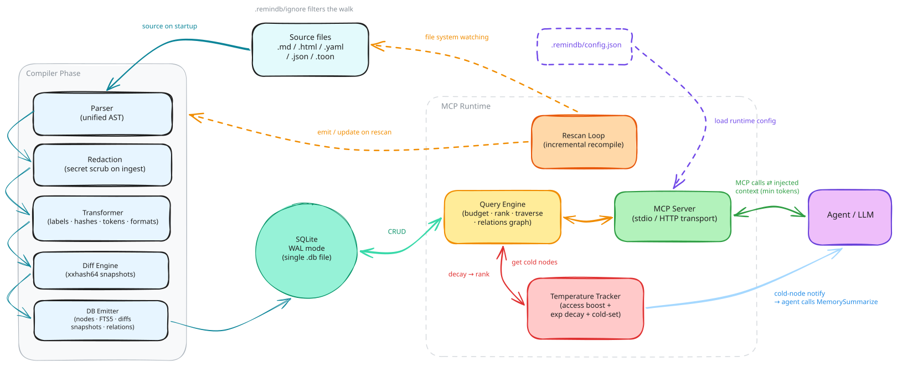
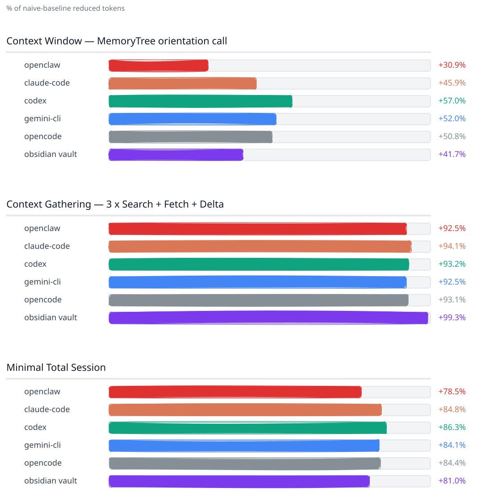

<p align="center">
  
</p>

<h1 align="center">remindb</h1>

<p align="center">
  Agentic memory in a single SQLite file.
  <br />
  Stop letting your agent re-read the same notes every session.
</p>

<p align="center">
  <a href="https://github.com/radimsem/remindb/actions/workflows/ci.yml"></a>
  <a href="https://github.com/radimsem/remindb/releases/latest"></a>
  <a href="LICENSE"></a>
  
</p>

---

<p align="center">
  
</p>

## Why I built this

Coding agents already have memory. `CLAUDE.md`, `AGENTS.md`, your notes folder, that growing pile of project READMEs. Stuff persists just fine.

The problem is *how* the agent consumes it. Every session starts by re-reading the whole pile from scratch — every `Read`, every `Grep`, scanning raw prose the agent has already processed dozens of times. Big context windows don't fix it. A 1M-token window is still paid per call, and still can't tell yesterday's stale note from today's relevant one.

Raw markdown is the wrong shape for memory. Not because it can't hold the words — it can — but because it forces the agent to pay full freight on every read.

`remindb` is a single SQLite file your agent treats as long-term memory. It parses your notes (Markdown, HTML, JSON, YAML, [TOON](https://github.com/toon-format/toon)) into a structured tree, hashes every node, encodes repetitive structures compactly when it saves tokens, and surfaces the whole thing through a tight MCP tool suite.

## What you get

Each point is a summary — the full reasoning, with the tradeoffs, lives in [`docs/`](./docs/).

**An ICR the agent can index, not skim.** `MemoryTree` returns the Intermediate Context Representation — typed, labeled, token-counted — in one call instead of a directory walk and a pile of file reads. → **[The node tree](./docs/node-tree.md)**

**Hot vs. cold, like a real cache.** Every node has a temperature that rises when it's read and decays over time. Hot nodes rank higher in search; cold ones stop crowding the top without ever being deleted. → **[Temperature](./docs/temperature.md)**

**Summarization that happens when it should.** When a node crosses the cold threshold the server nudges the agent to compact it in place — same anchor, same history, fewer tokens. No cron, no worker; it's driven by how the memory actually gets used. → **[Temperature](./docs/temperature.md#summarization-that-fires-when-it-should)**

**Git-style versioning, free.** Every compile or write lands a snapshot with per-node diffs. A returning agent resyncs with `MemoryDelta` — a tiny payload instead of a whole-file re-read. → **[Versioning](./docs/versioning.md)**

**TOON encoding where it pays off.** Arrays of uniform objects store ~40% smaller in TOON than YAML or JSON. The parser tries both per node and keeps the win only when it's real; irregular prose stays plain text. The same ≥15% rule converts MathML in HTML to compact LaTeX. → **[TOON encoding](./docs/toon-encoding.md)** · **[MathML → LaTeX](./docs/mathml-latex.md)**

**FTS5 search, not grep.** Ranked anchors in milliseconds over a porter-tokenized index — no file rescans, no regex timeouts — trimmed to exactly the token budget you pass. → **[Search](./docs/search.md)**

**Knowledge graph from lateral relations.** Author `[[Architecture; w=2.5]]` in any payload and the compiler resolves a directed weighted edge; `MemoryRelated` traverses it up to 5 hops, ranked by path weight. Forward references self-heal. → **[Knowledge graph](./docs/knowledge-graph.md)**

**Portable by design.** The whole memory is one `.db` file. Copy it to another machine, hand it to another agent, commit it into a repo, sync it across devices. No server, no daemon, no external state — any MCP-capable agent can point `serve` at the same file and share the same knowledge.

## Install

### One-line install

**Linux / macOS:**

```bash
curl -fsSL https://raw.githubusercontent.com/radimsem/remindb/main/install.sh | bash
```

By default the binary lands at `~/.local/bin/remindb`. Pick a different prefix:

```bash
curl -fsSL https://raw.githubusercontent.com/radimsem/remindb/main/install.sh | bash -s -- --prefix /usr/local
```

**Windows (PowerShell 5.1+):**

```powershell
iwr -useb https://raw.githubusercontent.com/radimsem/remindb/main/install.ps1 | iex
```

Lands at `%LOCALAPPDATA%\Programs\remindb\bin\remindb.exe`. Override with `-Prefix`:

```powershell
./install.ps1 -Prefix C:\tools\remindb
```

### From source (Go 1.26+)

```bash
git clone https://github.com/radimsem/remindb.git
cd remindb
go build -o ~/.local/bin/remindb ./cmd/remindb
```

Verify:

```bash
remindb --version
```

## Updating

Two moving parts: the **binary** (release tags) and the **agent-side skills** (`remind`, `memorize` — the markdown your agent loads to learn how to call the MCP tools). They iterate on different cadences, so they update independently.

### Binary

```bash
remindb update
```

Reads the installed version, compares it against the latest GitHub release, and re-runs the install script only when they differ. `dev`-builds (from `go build` / `go install`) always proceed — there's no published version to compare against. Pass `--force` to reinstall regardless:

```bash
remindb update --force
```

### Skills

The public skills live under [`skills/`](skills/): [`remember`](skills/remember/SKILL.md) (the plain-language front door), [`remind`](skills/remind/SKILL.md) (read path), [`memorize`](skills/memorize/SKILL.md) (write path), and [`remindb-setup`](skills/remindb-setup/SKILL.md) (connectivity/config). `remind` and `memorize` use progressive disclosure — a compact `SKILL.md` plus on-demand `references/`. They're refreshed by [`vercel-labs/skills`](https://github.com/vercel-labs/skills).

First-time install — globally (every detected agent), or scoped to one agent:

```bash
# Global — install for all detected agents at once
npx skills@latest add radimsem/remindb/skills
```

```bash
# Scoped — install for one agent
npx skills@latest add radimsem/remindb/skills -a claude-code
# -a codex | gemini-cli | opencode | openclaw | hermes-agent | ...
```

Refresh later:

```bash
npx skills@latest update
```

## Documentation

The README is the trailer. The manual is in [`docs/`](./docs/) — each page opens with the problem it solves, in plain language.

| Page | What's there |
|------|--------------|
| [Architecture](./docs/architecture.md) | The layer-by-layer map: parser → transformer → emitter → store, then query → mcp. |
| [CLI reference](./docs/cli.md) | Every subcommand — `compile`, `serve`, `inspect`, `bench`, `doctor`, `update` — with flags. |
| [Configuration](./docs/configuration.md) | The `.remindb/` directory: `config.json` feature blocks, `ignore`, `temperatures.json`, `pinned`. |
| [The node tree](./docs/node-tree.md) · [Temperature](./docs/temperature.md) · [Versioning](./docs/versioning.md) · [Search](./docs/search.md) · [TOON](./docs/toon-encoding.md) · [MathML → LaTeX](./docs/mathml-latex.md) · [Knowledge graph](./docs/knowledge-graph.md) | The feature deep-dives linked from *What you get*. |

## MCP tools

A `Memory*` tool suite, registered once, surfaced to any MCP-capable agent (Claude Code, Codex, Gemini CLI, OpenCode, OpenClaw, Hermes Agent, …). The read path is documented in the [`remind`](./skills/remind/) skill, the write path in [`memorize`](./skills/memorize/).

| Tool | Purpose |
|------|---------|
| **`MemoryTree`** | Renders the full node hierarchy with labels, types, IDs, temperatures, and token counts. The agent's cheap orientation call. |
| **`MemorySearch`** | FTS5 full-text search over labels and content. Returns ranked anchors within a token budget. |
| **`MemoryFetch`** | Returns one anchor plus its ancestors and children, trimmed to a token budget. The "read just this region" call. |
| **`MemoryFetchBatch`** | Fetches many anchors in one round-trip under a shared budget — the "read every search hit at once" call. No per-call framing tax. |
| **`MemoryDelta`** | Returns only the nodes that changed since a given snapshot cursor. Lets agents resync with a tiny payload instead of re-reading files. |
| **`MemoryDiff`** | Compares two arbitrary snapshots git-diff-style. Point-in-time forensic comparison; both ends fixed. |
| **`MemoryHistory`** | Browses the version history of a node — who/when/how it changed, rollback-capable via stored old content. |
| **`MemoryRelated`** | Traverses the relations graph from an anchor — outgoing/incoming/both, up to 5 hops, ranked by summed path weight. Surfaces what an authored `[[Label]]` wiki-link connects to. |
| **`MemoryStats`** | Reports DB health and shape: node/token totals with per-type breakdown, snapshot/cursor summary, temperature spread, relations, FTS row count. Read-only, single round-trip. Same data the `remindb inspect` CLI renders. |
| **`MemoryWrite`** | Writes or updates content at an anchor. Creates a new snapshot and a per-node diff. |
| **`MemorySummarize`** | Replaces a node's content with a shorter summary the agent provides. Used when the temperature tracker flags a cold node. |
| **`MemoryCompile`** | Compiles source files or a directory into the database from inside a session. Same engine as the `compile` CLI. |
| **`MemoryRelate`** | Creates a manual edge between two existing nodes. Resolves the target the same way parsed wiki-links do (id → source+label → label only). Does not create a snapshot — relations are a sideband. |
| **`MemoryForget`** | Explicitly removes a node. Three deletion modes (including `reparent`, which rewires children up to the deleted node's parent). |
| **`MemoryRollback`** | Walks the graph back to a prior snapshot, optionally pruning the history after it. Still produces exactly one snapshot. |
| **`MemoryPin`** | Protects a node from temperature decay and the cold-summarize loop — for reference material that must not age out. |
| **`MemoryUnpin`** | Releases a pin, returning the node to normal decay. |

### Resources

Resources give desktop clients and dashboards passive read access to database state. Unlike the `Memory*` tools, they never boost temperature, take locks, or emit snapshots — a heatmap that warmed the nodes it displayed would measure its own rendering.

| Resource | Description |
|----------|-------------|
| `remindb://overview` | Database stats as JSON — the `MemoryStats` equivalent for renderers. |
| `remindb://files` | Compiled source files grouped by compile root, with per-file node and token counts. |
| `remindb://tree` | Full node hierarchy as nested JSON. `tree/{rootId}{?depth}` for a bounded subtree. |
| `remindb://graph` | Relations graph — resolved edges, pending wiki-link targets, and the node set they reference. |
| `remindb://snapshots` | Version history. `snapshots{?limit}` for the newest N; `snapshots/{id}/diffs` for one snapshot's diffs. |
| `remindb://temperature` | Per-node temperature heatmap, with the cut thresholds used to classify hot and cold. |
| `remindb://doctor` | Health-check report as JSON (same data as `remindb doctor --json`). |
| `remindb://logs` | Recent server log records from the in-memory ring buffer. |
| `remindb://sessions` | Active MCP client sessions on this process. |
| `remindb://sessions/history` | Durable per-client connection ledger across restarts. `sessions/history/{hash}` for one client. |
| `remindb://sessions/logs` | Per-session logfile index. `sessions/logs/{id}` for one session's structured tool-call trace. |
| `remindb://rescan` | Latest source-rescan tick result. |

Several are subscribable — clients can receive push notifications on state changes instead of polling. The full resource contract, envelope shapes, and subscription events are in [`docs/resources.md`](./docs/resources.md).

### Agent integrations

Six plugin folders ship with the repo, one per supported agent host. Five are short declarative manifests matching the host's plugin spec; the Hermes Agent one is a Python `MemoryProvider` implementation that spawns `remindb serve` as a subprocess. Each folder has a README with install commands, env-var conventions, and a worked example.

| Agent | Folder | Install docs |
|-------|--------|--------------|
| Claude Code | [`plugins/claude-code/`](./plugins/claude-code/) | [plugins/claude-code/README.md](./plugins/claude-code/README.md) |
| Gemini CLI | [`plugins/gemini-cli/`](./plugins/gemini-cli/) | [plugins/gemini-cli/README.md](./plugins/gemini-cli/README.md) |
| Codex | [`plugins/codex/`](./plugins/codex/) | [plugins/codex/README.md](./plugins/codex/README.md) |
| OpenCode | [`plugins/opencode/`](./plugins/opencode/) | [plugins/opencode/README.md](./plugins/opencode/README.md) |
| OpenClaw | [`plugins/openclaw/`](./plugins/openclaw/) | [plugins/openclaw/README.md](./plugins/openclaw/README.md) |
| Hermes Agent | [`plugins/hermes-agent/memory/remindb/`](./plugins/hermes-agent/memory/remindb/) | [plugins/hermes-agent/memory/remindb/README.md](./plugins/hermes-agent/memory/remindb/README.md) |

> [!TIP]
> **Pair the plugin with the two companion skills** — [`remind`](./skills/remind/) (read path) and [`memorize`](./skills/memorize/) (write path). They teach the agent the MCP tool suite so you don't re-explain it each session. Per-agent install instructions live in [`skills/README.md`](./skills/).

For any other MCP-capable agent, add this to its MCP config by hand. Stdio (the default — one server per client process):

```json
{
  "mcpServers": {
    "remindb": {
      "type": "stdio",
      "command": "remindb",
      "args": ["serve"],
      "env": {
        "REMINDB_DB": "/absolute/path/to/memory.db",
        "REMINDB_SOURCE": "/absolute/path/to/notes"
      }
    }
  }
}
```

Every `serve` flag has a `REMINDB_*` environment equivalent — `REMINDB_DB`, `REMINDB_SOURCE`, `REMINDB_RESCAN_INTERVAL`, `REMINDB_TRANSPORT`, `REMINDB_LISTEN`, `REMINDB_INSECURE_PUBLIC` — plus the env-only `REMINDB_AUTH_TOKEN` for HTTP bearer-token auth (see [SECURITY.md](./SECURITY.md#threat-model)). Pass them via `args`, the `env` block above, or a committed `.remindb/config.json`. Precedence is explicit flag → `.remindb/config.json` → env → built-in default; see [Configuration](./docs/configuration.md).

Or HTTP, when you want one long-running server that multiple agent sessions (a local IDE, a CI worker, a hosted session) share. Start `remindb serve --transport http --db ... --source ...` once, then point each client at the listen URL:

```json
{
  "mcpServers": {
    "remindb": {
      "type": "http",
      "url": "http://127.0.0.1:7474"
    }
  }
}
```

On startup the agent sees the full `Memory*` tool suite alongside its usual toolbox.

You don't hand-write any of that, though — the **`remindb-setup`** skill (installed via `npx skills add`, above) is a **config-first wizard** that runs from inside a session. Because the skill installs independently of the MCP plugin, its first pass runs *before* any server is attached. On hosts that expose it as a slash command (Claude Code, OpenClaw):

```
/remindb-setup            # interactive — walks you through each .remindb/ choice
/remindb-setup automode   # hands-off — the agent infers the whole setup itself
```

Codex, OpenCode, and Gemini CLI surface the same skill differently — the `/skills` picker, a `$remindb-setup` mention, or plain-language activation; each plugin README gives the exact invocation. Either way, it detects the host, authors `.remindb/` (`ignore`/`pinned`/`temperatures.json`/`config.json`) **before** compiling — so those settings apply at insert time, no reseed retrofit — runs the compile, offers to seed adjacent context (`CLAUDE.md`/`AGENTS.md`/`README`), and wires the MCP `env` for you using your host's durable mechanism. Then you enable the plugin and restart; re-running the wizard with the server attached is the verify pass (`MemoryStats` + `remindb://doctor`). Per-host invocation and env details live in [`skills/remindb-setup/`](./skills/remindb-setup/). (Hermes Agent is a memory-provider bridge, not an MCP-config host — it uses `hermes memory setup` instead; see its [plugin README](./plugins/hermes-agent/memory/remindb/).)

Once that's done, talking to your memory is plain language — the **`/remember`** front door routes recall to `remind` and saves to `memorize`, so you never name a tool:

```
/remember what did we decide about <topic>? Pull it from memory — don't re-read the files.
```

It searches the node tree, fetches the top hits under a token budget, and answers from memory, citing which file each fact came from — instead of grepping and re-reading prose it has already seen. The same door takes saves: `/remember note that <fact>` routes to a structured write.

## Benchmarks

Token counts are measured against the naive baseline an agent falls back to without a memory layer: list the directory, read every matching file, grep through it. Numbers come from `./scripts/bench-agents.sh` over the five plugin fixtures in `testdata/`, plus a one-off compile of a real Obsidian vault (~450 markdown files across AI concepts, market briefs, security notes, and MOCs — ~3.3M naive tokens end-to-end).

The scenario suite (tree · 3 searches · fetch · delta) rolls up into three workflow categories:

- **context window** — a single `MemoryTree` orientation call.
- **context gathering** — 3 × `MemorySearch` + `MemoryFetch` + `MemoryDelta`, token-weighted.
- **total session** — sum of both.

> [!NOTE]
> **Corpus size moves the numbers in remindb's favour.** The plugin fixtures are ~3k–20k tokens each; the vault is ~3.3M. As the corpus grows, the naive baseline scales linearly (more files to list, more bytes to grep, more prose to re-read), while remindb's answers stay bounded by the token budget you pass. That's why the vault's context-gathering row hits **99.8%** — every search still returns ~1k tokens, but the baseline is now ~100× larger.
>
> The scenario list is also intentionally short. A real 30-minute agent session does dozens of orient/search/fetch/write/re-orient cycles, and the same search often fires three or four times as the agent loops on a problem. Each of those calls compounds toward **90%+ full-session savings** on realistic corpora.

<p align="center">
  
</p>

<sub>The `obsidian vault` row is a real vault: ~450 markdown files, ~3.3M naive tokens.</sub>

Reproduce the table yourself:

```bash
./scripts/bench-agents.sh
```

## Contributing

This is a project I maintain between classes — patches, bug reports, and ideas are genuinely welcome, and an extra pair of eyes goes a long way. The full guide lives in [`CONTRIBUTING.md`](./CONTRIBUTING.md): branch naming, the pre-PR checklist, the doc-update map, and how the AI-assisted workflow is wired up. If you want to start small, the "First-time contributors" section there has good entry points.

## License

MIT — see [`LICENSE`](LICENSE).

## Support

I'm a college student building agentic AI tooling in the evenings and weekends between classes. `remindb` is free, MIT-licensed, and will stay that way — no telemetry.

If this saved you tokens (or saved you from reading the same 100 files for the hundredth time), even a small tip helps a lot.

<p align="left">
  <a href="https://www.buymeacoffee.com/radimsem" target="_blank"></a>
</p>

Or send BTC to `bc1qwyxsx7sledl4pru8y5ykd54fevsklytrv95ual`.

Thanks for reading this far. If you end up using `remindb` in anger, I'd love to hear what you built — open an issue with a short story, or drop a star. Both matter more than you'd think.
