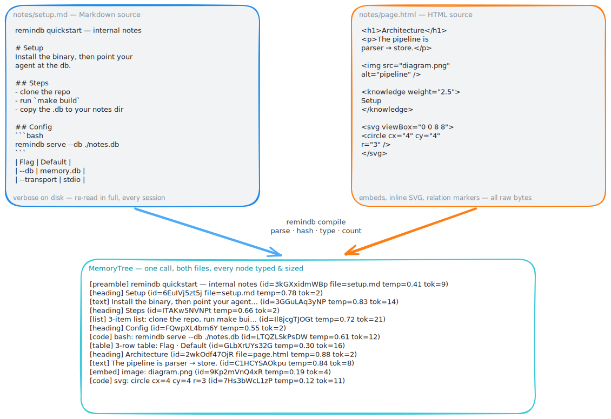

# The node tree

> An agent shouldn't have to `ls` a folder and read every file just to remember what's in it.

[← back to README](../README.md) · related: [search](./search.md) · [temperature](./temperature.md) · [versioning](./versioning.md)

<p align="center">
  
</p>

## The problem

Watch an agent start a session. It lists a directory. It reads `CLAUDE.md`. It reads the notes folder. It greps for the thing it half-remembers. Every one of those is full-price prose it has already processed a dozen times, and none of it tells the agent what's *important* — just what exists.

That's the wrong shape for memory. A folder is a pile. Memory should be an index.

## What I built instead

When remindb compiles your notes, it doesn't store them as files. It parses them into a tree of **typed nodes**. One `MemoryTree` call hands the agent the whole index — no directory walk, no file reads.

Each node is one unit of meaning with a fixed set of fields:

- An **11-char base62 ID** (`3kGXxidmWBp`), content-addressed with xxhash64. It's the anchor for every follow-up call. Nobody guesses it or edits it — the content decides it.
- A **`parent_id`**. Nodes form a tree, so structure survives the trip from Markdown into SQLite.
- A **`label`** — the first meaningful line, capped short. This is what the agent scans.
- A **`node_type`** — one of `heading`, `list`, `kv`, `table`, `preamble`, `text`, `code`, `embed`. The type hints at shape, not behavior.
- A **`token_count`** — estimated cl100k-base tokens, so the query layer can honor a budget instead of guessing.
- A **`temperature`** — how warm the node is. That's its own story; see [temperature](./temperature.md).

## What the agent actually sees

This is a real slice from `remindb inspect --tree`:

```
[preamble] Preamble: framework, language, project (id=3kGXxidmWBp file=CLAUDE.md temp=0.50 tok=14)
[heading] Project Instructions (id=6EuIVj5zt5j file=CLAUDE.md temp=0.75 tok=5)
  [heading] Architecture (id=603qfsg4qd2 temp=0.88 tok=3)
    [text] Next.js 15 conventions with a clear separation of data… (id=3GGuLAq3yNP temp=0.82 tok=111)
    [list] 7-item list: app/, components/, lib/, db/, hooks/, types… (id=ITAKw5NVNPt temp=0.71 tok=228)
  [heading] Data Model (id=FQwpXL4bm6Y temp=0.62 tok=3)
    [list] 7-item list: products, variants, orders, carts, users, s… (id=Il8jcgTJOGt temp=0.55 tok=155)
  [heading] Payment Integration (id=LTQZLSkPsDW temp=0.30 tok=5)
    [text] Stripe Payment Intents; not legacy Checkout Sessions… (id=GLbXrUYs32G temp=0.24 tok=35)
  [heading] Observability (id=2wkOdf47OjR temp=0.08 tok=4)
    [list] 4-item list: Sentry · Vercel logs · OTel tracing · Prom… (id=C1HCYSAOkpu temp=0.08 tok=90)
```

Think of it as `ls -la` for memory. One call, a scannable index, every entry already labeled and sized — and the hot stuff floating to the top so the agent knows where to look before it spends a single token reading.

## Why typed nodes, not raw text

A heading is not a paragraph is not a table. Storing them all as "text" throws away the one thing that makes memory navigable. Because every node carries its type and its place in the tree, the agent can decide *whether* to fetch a region before paying to read it — and the [search](./search.md), [TOON encoding](./toon-encoding.md), and [versioning](./versioning.md) layers all key off the same structure.
