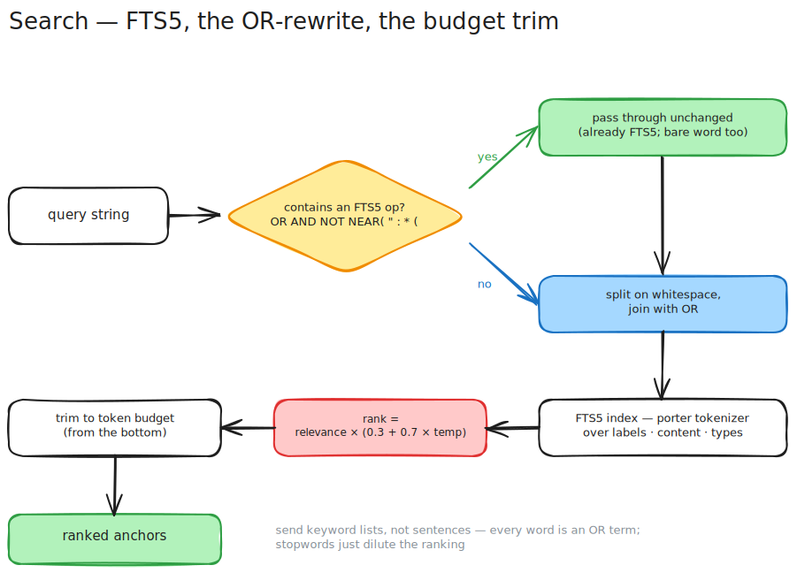

# Search — FTS5, not grep

> Grep rescans the world every time. Search should be an index lookup that respects a token budget.

[← back to README](../README.md) · related: [node tree](./node-tree.md) · [temperature](./temperature.md)

<p align="center">
  
</p>

## The problem

When an agent doesn't have a memory layer, "find where I wrote about rate limiting" means: list the directory, read the candidate files, grep through them, hope the regex didn't time out on the big one. It's O(corpus) every single time, and it returns raw bytes — no ranking, no notion of what's recently relevant, no way to say "give me 500 tokens of the best matches and stop."

## What I built

Search runs on SQLite's **FTS5** virtual table, built at write time with a porter tokenizer over labels, content, and types. `MemorySearch` returns ranked anchors in milliseconds — no file rescan, no regex, no timeout. Ask for 500 tokens of matches and you get exactly 500: the engine fills up to the budget and stops, which is cheaper than returning everything and hoping the client truncates.

Ranking folds in [temperature](./temperature.md): `score = relevance × (0.3 + 0.7 × temperature)`, where relevance is FTS5's BM25-like rank. A cold node with a strong match still surfaces; a warm node with a weak one does too. The budget trims from the bottom *after* ranking.

## The one thing you must know: the OR rewrite

There's a small pre-processing step that changes how you should phrase queries. Before a query hits FTS5, the server checks for any FTS5 operator:

```
OR   AND   NOT   NEAR(   "   :   *   (
```

- If **any** appears → the query passes through unchanged (it's already FTS5).
- Otherwise → it's whitespace-split and joined with ` OR `.
- A single bare word passes through unchanged.

So a bare multi-word query is "match any of these words, rank by how many hit":

```
"token bucket rate limit"  →  token OR bucket OR rate OR limit
"token AND bucket"         →  passed through (has AND): both required
"\"token bucket\""         →  passed through (has "): exact adjacent phrase
```

The practical rules that fall out of this:

1. **Send keyword lists, not sentences.** "how do I configure the rate limiter" becomes `how OR do OR I OR configure OR …` — the function words dilute the ranking. Strip them.
2. **Bare multi-word = broad recall.** Use it when you want any-of matching ranked by overlap.
3. **Reach for operators when you need precision.** `"exact phrase"`, `a AND b`, `a NOT b`, `prefix*`, `NEAR(a b, 5)`.
4. **Quote internal punctuation.** Hyphens and dots are tokenizer boundaries — search `"rate-limit"` quoted to match the hyphenated form.

## Fetching what you found

`MemorySearch` returns anchors, not bodies. Expand one with `MemoryFetch` (anchor + ancestors + children, depth-bounded), or — when you want the content of every hit at once — `MemoryFetchBatch`: one round-trip, one shared budget, input order preserved, with inline `not found` / `over budget` markers so a single bad ID never poisons the batch. Don't fan out N `MemoryFetch` calls when one batch does it.
