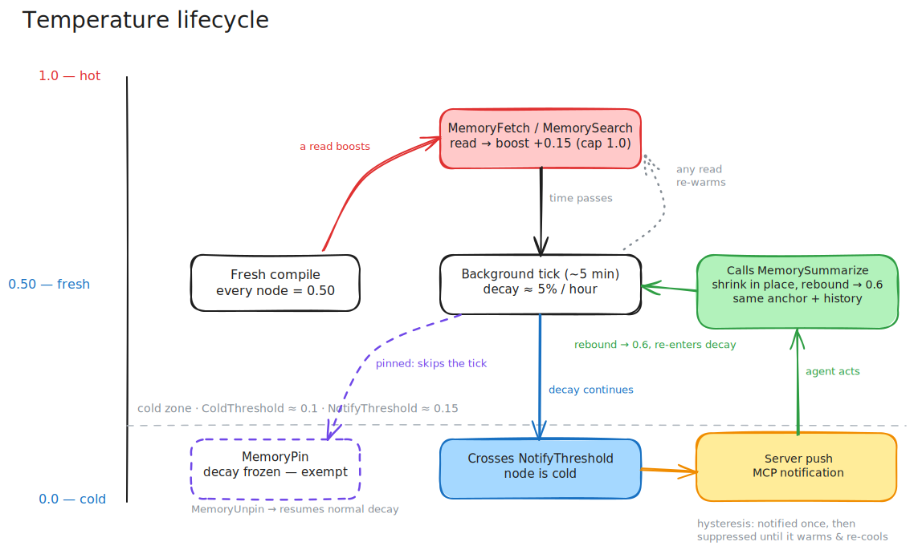

# Temperature — hot, cold, and self-summarizing

> A real cache evicts what nobody touches. Memory should too — except it shouldn't *delete*, it should *shrink*.

[← back to README](../README.md) · related: [node tree](./node-tree.md) · [search](./search.md) · [versioning](./versioning.md)

<p align="center">
  
</p>

## The problem

Notes don't age evenly. The architecture section gets read every session. That observability checklist you wrote once and never opened again still sits there, full size, crowding every search result and costing tokens on every tree dump. A pile of Markdown has no way to tell yesterday's stale note from today's hot one. A 1M-token window doesn't fix that — it just lets you pay for the staleness in bulk.

I wanted memory that behaves like a cache: what gets used stays sharp, what goes quiet gets out of the way — without ever losing the content.

## Hot vs. cold

Every node carries a **temperature** in `[0.0, 1.0]`. A fresh compile starts everything at `0.50`.

- **Reads warm it.** Every `MemoryFetch` / `MemorySearch` hit boosts the node (`+0.15`, capped at `1.0`).
- **Time cools it.** A background tick decays everything by `factor = exp(-0.05 × elapsed_hours)` — roughly 5% an hour. Default tick is every 5 minutes; nothing is real-time.

The spread you see in a [tree dump](./node-tree.md) is the history of how the memory was actually used. *Architecture* sits at `0.88` because the agent keeps coming back. *Observability* has decayed to `0.08` because nobody has.

Temperature feeds [search ranking](./search.md): `score = relevance × (0.3 + 0.7 × temperature)`. A cold node with a great keyword match still surfaces — it just stops crowding the top when its match is weak. Cold never means gone.

Two thresholds gate what happens next, independent so an operator can run a tighter alert band than the cold-set query:

- **`ColdThreshold`** — the floor `GetColdNodes` and the search ranking use to call a node "cold".
- **`NotifyThreshold`** — the line that triggers the nudge below.

## Summarization that fires when it should

Here's the part I'm proud of. Most "summarize your old notes" systems are a cron job or a manual chore. remindb doesn't have either.

When a node decays past `NotifyThreshold`, the MCP server pushes a notification straight to the agent over the MCP `notifications/message` channel — `level: "warning"`, `logger: "remindb.temperature"`:

```json
{
  "message": "Cold nodes detected; consider summarizing via MemorySummarize",
  "suggested_action": "MemorySummarize",
  "nodes": [
    { "id": "<11-char base62>", "label": "...", "file": "...", "temperature": 0.07 }
  ]
}
```

The agent reads what's there, then calls `MemorySummarize` with a shorter rewrite. The node **shrinks in place** — same anchor in the tree, same version history (see [versioning](./versioning.md)), just fewer tokens. No external worker, no scheduled job. Compaction happens in-band, driven by how the memory actually got used.

The server dedups with hysteresis: a node is notified once when it crosses below `NotifyThreshold`, then suppressed until it warms back above and re-cools. A node oscillating around the line doesn't spam the agent.

## When you want a node to stop decaying

Some notes are reference material the agent rarely reads but must never lose to the cold-summarize loop — a security policy, a hard constraint. Pin it (`MemoryPin`) and decay stops touching it; `MemoryUnpin` puts it back in the flow. Pinning is the explicit override for "this matters even when nobody's looking at it."
