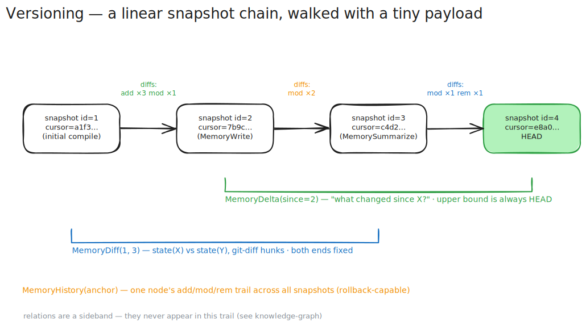

# Versioning — git-style history, for free

> Every write should leave a trail you can walk backward. You shouldn't have to set anything up to get it.

[← back to README](../README.md) · related: [node tree](./node-tree.md) · [temperature](./temperature.md) · [knowledge graph](./knowledge-graph.md)

  

## The problem

When an agent edits memory, two things usually go wrong. Either there's no history at all — the old wording is just gone — or "history" means re-reading the whole file to figure out what moved. Both are bad. The first loses information; the second is the exact full-freight re-read remindb exists to avoid.

I wanted version control that costs nothing to maintain and lets a returning agent resync with a tiny payload instead of a whole-file diff.

## Snapshots

Every `MemoryCompile`, `MemoryWrite`, `MemorySummarize`, and `MemoryRollback` lands a **snapshot**: a row with an auto-increment `id` (int64) and a `cursor_hash` (xxhash64 of the entire DB state). Snapshots form a linear parent chain — no branches, no merge commits, just a straight line of "here's what the world looked like."

The `id` is what you hand to `MemoryDelta`. The `cursor_hash` is an opaque fingerprint — store it, compare it later for equality, but don't try to read meaning into it.

One call, one snapshot. That invariant is load-bearing: it's what keeps the diff trail something an agent can walk without surprises.

## Diffs

Each snapshot carries per-node diffs — `add`, `mod`, or `rem` — with **both** the old and new content preserved. That's what makes rollback possible: the previous wording is still there to write back.

One subtlety worth knowing: a `mod` whose `old_hash == new_hash` is a **structural-only** change — the content didn't move, the node's position in the tree did. The usual cause is `MemoryForget` with `mode=reparent`, which deletes a node and rewires its children up to the deleted node's parent. If a delta surprises you with a content-identical `mod`, look for a `rem` in the same snapshot to find the deletion that moved it.

## Reading the trail

Three tools, picked by which end of the range is fixed:

- **`MemoryDelta`** — "what changed since X?" The upper bound is always HEAD. This is the resync call: pass the last snapshot `id` you saw and get back just the changed nodes, not the whole tree.
- **`MemoryDiff`** — "what changed between X and Y?" Both ends fixed, git-diff-style hunks. State at X versus state at Y, not the per-snapshot event log between them — intermediate jitter collapses to the net change. This is the forensic call (rollback target vs. result, yesterday's compile vs. today's).
- **`MemoryHistory`** — the diff trail for one specific node. Use it before overwriting something, or to cite prior wording.

## Undo

`MemoryRollback` walks the graph back to a prior snapshot, optionally pruning the history after it. It still produces exactly one snapshot row — rollback is a forward step that happens to restore old content, not a rewrite of the past. Relations are deliberately *not* part of this trail; the [knowledge graph](./knowledge-graph.md) is a sideband that `MemoryDelta` and `MemoryHistory` don't surface.

The point of all this: a returning agent calls `MemoryDelta` with its last cursor and gets a few lines back. It never re-reads the file.
